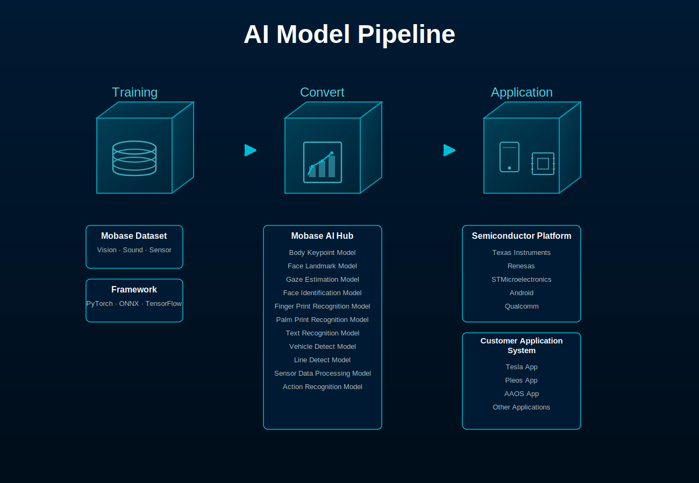

<!--  

 
 

<!-- # Mobase AI Models Hub -->

# Mobase AI Models Hub

---

## 📘 개요 (Overview)

**Mobase AI Models Hub**는 다양한 **비전, 음성, 센서 기반 인식 기술**을 통합한 AI 모델 플랫폼입니다.

본 프로젝트는 표준화 된 **Mobase** **AI Dataset**을 구축하고 **AI Model Hub**를 개발하는 것을 목표로 합니다.

**Mobase AI Models Hub** is an AI model platform that integrates various **vision, voice, and sensor-based recognition technologies**.

The goal of this project is to build a standardized **Mobase** **AI Dataset** and develop an **AI Model Hub**.

---

## 🎯 주요 개발 항목 (Development Items)

- 💾 **Mobase AI Dataset 구축 (Build Mobase AI Dataset)**
- 🧠 **Mobase AI Models Hub 구축 (Develop AI Models Hub) - Vision / Sound / Sensors..**
- 🔄 **Edge Device를 위한** **모델 경량화 Pipeline 개발 (Model Optimization Pipeline for Edge Device)**

---

## 🤖 AI 모델 목록 (AI Model List)

| 분류 (Category) | AI 모델 (AI Model) | 주요 용도 (Application) | 링크 (Link) |
|:---:| --- | --- |:---:|
| **생체 인식 (Biometric Recognition)** | Body Keypoints Detection | 동작 인식, 자세 분석 / Motion & Posture Analysis |[ 👉](https://github.com/mobaseelecAI/Mobase_AI_Hub/blob/main/Pose%20Estimation/README.md)|
|  | Face Landmarks Detection | 운전자 모니터링, 시선 추적 / Driver Monitoring, Gaze Tracking |                    |
|  | Gaze Estimation | 운전자 시선 추적 / Gaze Estimation |                    |
|  | Face Recognition | 사용자 인증 / User Authentication |                    |
|  | Iris/Finger/Palm Recognition | 생체 인증 / Biometric Security |                    |
|  | Speech Recognition | 음성 명령 / Voice Command |                    |
|  | Action Recognition | 이상 행동 감지 / Action & Anomaly Detection |                    |
| **물체 인식 (Object Recognition)** | Vehicle / Motorcycle Detection | ADAS, 보행자 인식 / ADAS, Pedestrian Detection |                    |
|  | Line / Pothole Detection | 도로 상태 분석 / Road Condition Detection |                    |
|  | Character Recognition | 번호판 / 문자 인식 / License Plate Recognition |                    |
| **상황 인지 (Context Awareness)** | Scene Analysis | 상황 인식 / Scene Understanding |                    |
|  | 3D Depth Map | 거리 추정 / Depth Estimation |                    |
|  | Sound Recognition | 음향 이벤트 탐지 / Acoustic Event Detection |                    |
|  | Sensor Data Classification | 환경 감지 / Sensor Data Analysis |                    |

---

### 📅 주요 완료 일정 (Milestones)

- 2025.10 → Body / Face Keypoints / Gaze / 3D Depth Map
- 2025.11 → Vehicle / Motorcycle Detection
- 2026.02 → Sound / Sensor Data Recognition
- 2026.03 → Speech / Action / Line / Character Recognition
- 2026.04 → Face / Iris / Finger / Palm Recognition
- 2026.08 → Scene Analysis
- 2026.11 → Mobase AI Dataset & Models Hub Finalization

---

## 📎 Contact

**Mobase AI Development Team**

📧 [support@MobaseelecAI](mailto:mobaseelec.mobaseai00@gmail.com)

🌐 [https://github.com/MobaseelecAR](https://github.com/MobaseelecAR)

---
