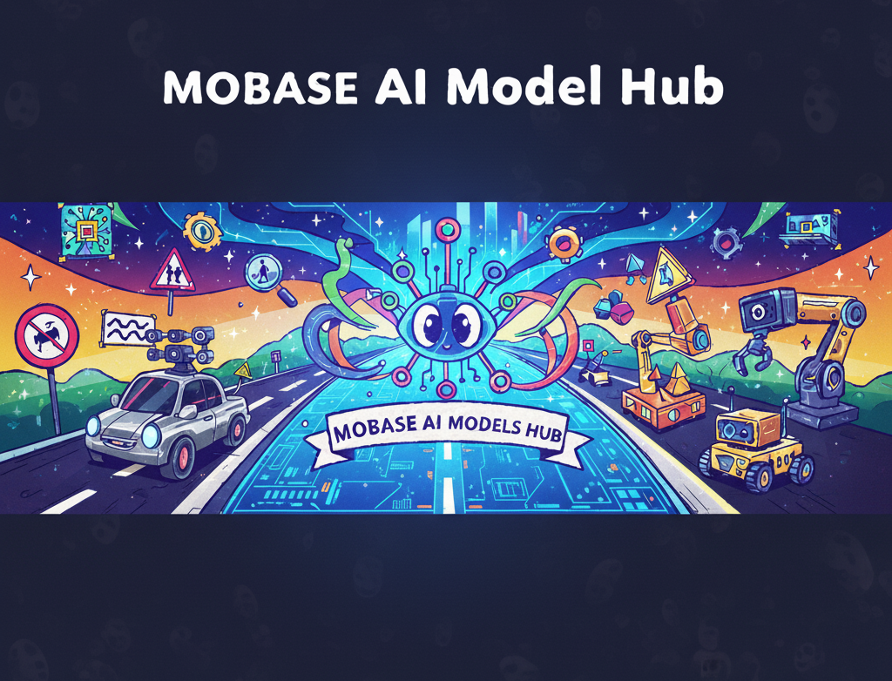
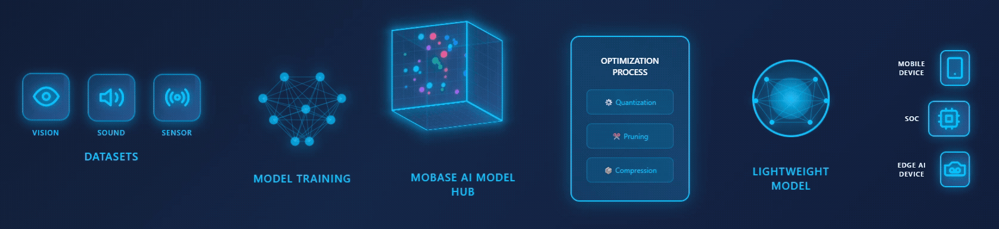

# README

MOBASE AI Models Hub is an AI model platform that integrates various Vision, Sound, and Sensor-based recognition technologies.

We are developing AI application for **Safety control, Sensor recognition, Human interactive devices, Display devices, Wearable devices, and more in the Mobility fields.** Most of our AI models are optimized for edge devices and operate without cloud connectivity, ensuring real-time processing and security.

Please refer to the [documentation below](##🛠️AI-Models) for more details. If you have any questions, you can get answers through the [contact information below](##📎Contact).

---

## ⭐ AI Models

MOBASE AI Datasets

    
    
    | 분류 (Category) | Dataset | Data 갯수 | 클래스 정보 |
    | --- | --- | --- | --- |
    |  |  |  |  |
    |  |  |  |  |

AI Models Hub

| 분류 (Category) | AI 모델 (AI Model) | 주요 용도 (Application) | 링크 (Link) |
| --- | --- | --- | --- |
| **생체 인식 (Biometric Recognition)** | Body Keypoints Detection | 동작 인식, 자세 분석 / Motion & Posture Analysis | [👉](https://github.com/mobaseelecAI/Mobase_AI_Hub/blob/main/Pose%20Estimation/README.md) |
|  | Face Landmarks Detection | 운전자 모니터링, 시선 추적 / Driver Monitoring, Gaze Tracking |  |
|  | Gaze Estimation | 운전자 시선 추적 / Gaze Estimation |  |
|  | Face Recognition | 사용자 인증 / User Authentication |  |
|  | Iris/Finger/Palm Recognition | 생체 인증 / Biometric Security |  |
|  | Speech Recognition | 음성 명령 / Voice Command |  |
|  | Action Recognition | 이상 행동 감지 / Action & Anomaly Detection |  |
| **물체 인식 (Object Recognition)** | Vehicle / Motorcycle Detection | ADAS, 보행자 인식 / ADAS, Pedestrian Detection |  |
|  | Line / Pothole Detection | 도로 상태 분석 / Road Condition Detection |  |
|  | Character Recognition | 번호판 / 문자 인식 / License Plate Recognition |  |
| **상황 인지 (Context Awareness)** | Scene Analysis | 상황 인식 / Scene Understanding |  |
|  | 3D Depth Map | 거리 추정 / Depth Estimation |  |
|  | Sound Recognition | 음향 이벤트 탐지 / Acoustic Event Detection |  |
|  | Sensor Data Classification | 환경 감지 / Sensor Data Analysis |  |

 

Model Optimization pipeline for Edge Device

    T.B.D

Model Result Visualization

    
    T.B.D

    

---

## 🛠️ Our Workflow

We train AI models with optimized architectures for target devices using our custom-built datasets. Subsequently, we perform quantization according to the target device and customer requirements, then test and deploy the integrated functionality and specifications.

---

## 📎 Contact

**Mobase AI Development Team**

📧 [support@MobaseelecAI](mailto:mobaseelec.mobaseai00@gmail.com)

🌐 [https://github.com/MobaseelecAR](https://github.com/MobaseelecAR)

---