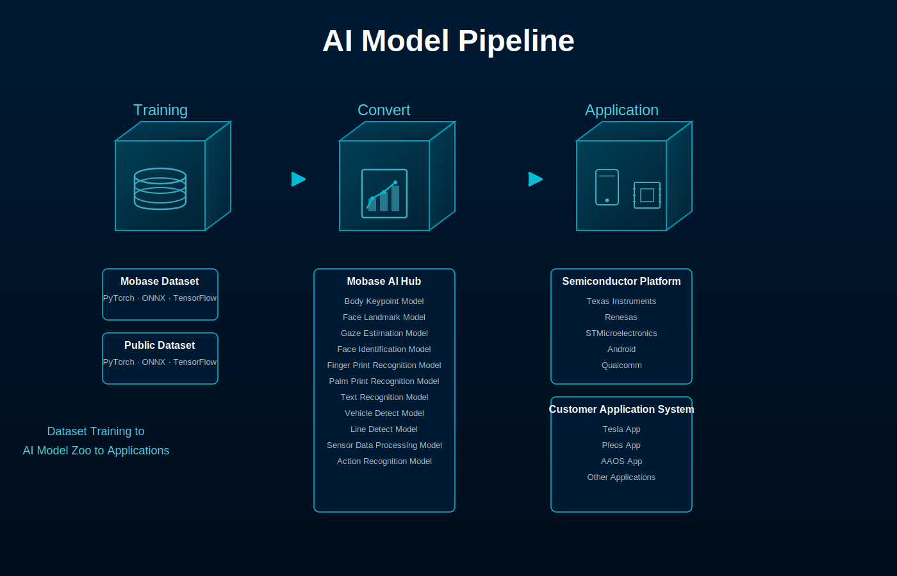

# Welcome MobaseAI

**Mobase Electronics** is a leading developer of next-generation

**smart mobility solutions** powered by automotive electronics and AI vision technology.

We provide advanced **object detection, Pose Estimation, Camera Pose** systems

optimized for **autonomous driving and ADAS (Advanced Driver Assistance Systems)**.

Our vision platforms combine **high performance, scalability, and embedded optimization**

to enhance the safety and efficiency of modern vehicles.

From research to commercialization,

**Mobase Electronics** is shaping the future as **the eyes of mobility**.

|  | 링크 | 개발유무 |
| --- | --- | --- |
| Object Detection |  | O |
| Pose Estimation |  | O |
| Camera Pose |  | O |
| Scene Analysis | - | - |
| Vehicle/Motorcycle Detection | - | - |